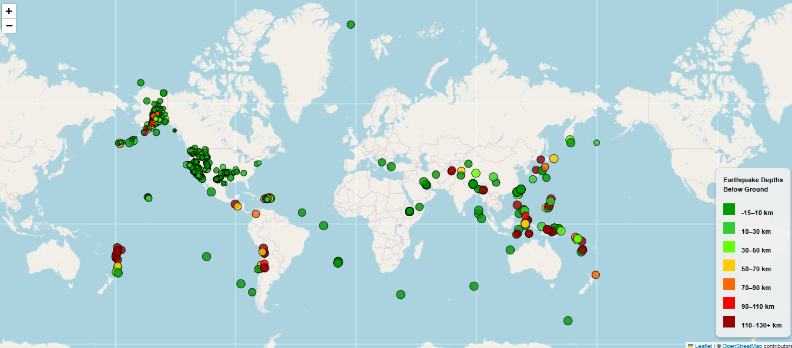
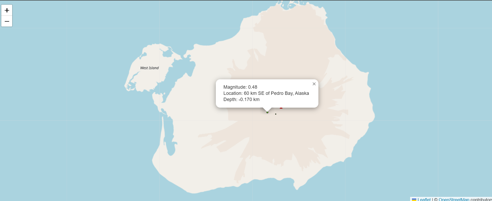
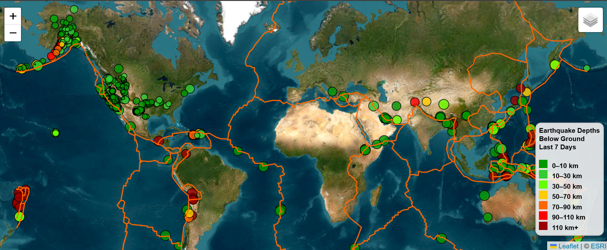

# **leaflet-challenge**

## **Table of Contents**

- [**leaflet-challenge**](#leaflet-challenge)
  - [**Table of Contents**](#table-of-contents)
  - [**Project Overview**](#project-overview)
  - [**Features**](#features)
  - [**Technologies / Dependencies Needed and Used**](#technologies--dependencies-needed-and-used)
  - [How to Run the Application](#how-to-run-the-application)
  - [**Visualizations**](#visualizations)
  - [**Data Source**](#data-source)
  - [**Visualization Details**](#visualization-details)
  - [**Development Process**](#development-process)
  - [**Sources**](#sources)
  - [**Additional Information**](#additional-information)
    - [Solution:](#solution)
  - [**License**](#license)
  - [**Project By**](#project-by)
  - [**Contact**](#contact)

## **Project Overview**
<br><br>
This project is focused on building an interactive map using Leaflet.js to visualize data related to global earthquakes and tectonic plates. By leveraging GeoJSON data from various sources, such as the USGS Earthquake Feed and OpenStreetMap, the map dynamically updates to display real-time earthquake activity, along with key information about the tectonic plates' locations and boundaries.


## **Features**
* Real-Time Earthquake Data: The map shows earthquake data from the USGS, updated in real time, using GeoJSON format for easy integration with Leaflet.
* Tectonic Plate Boundaries: Tectonic plates are plotted on the map, providing a visual reference for the correlation between seismic activity and plate boundaries.
* Interactive Map: Users can zoom, pan, and click on map elements to access additional information, such as earthquake magnitudes, depths, and locations.
* 1. Part 1 of interactive map can be found here [Github Pages Part 1](https://realmattimatt.github.io/leaflet-challenge.html)
* 2. Part 2 of interactive map can be found here [Github Pages Part 2](https://realmattimatt.github.io/leaflet-challenge/indexPart2.html)

## **Technologies / Dependencies Needed and Used**
* HTML: For structuring the content of the webpage.
* CSS: For styling the map and other elements to ensure a user-friendly interface.
* JavaScript: For implementing interactivity, data handling, and integrating with external libraries.
* Leaflet: A leading JavaScript library for interactive maps, used to render the map and display real-time data.
* D3: A JavaScript library for manipulating documents based on data, particularly used for rendering dynamic, data-driven visualizations on the map.

## How to Run the Application

1. **Access the Application:**
   - Navigate to [Github Pages Part 1](https://realmattimatt.github.io/leaflet-challenge/index.html) to view the live version of the interactive map.

2. **Interact with the Map:**
   - Once the page loads, you will see an interactive map showing real-time earthquake data.
   - Use your mouse to zoom in and out of the map.
   - Click on earthquake markers to view detailed information such as magnitude, depth, and location.

3. **Explore Part 2 Features:**
   - [Github Pages Part 2](https://realmattimatt.github.io/leaflet-challenge/indexPart2.html) includes additional base layers that you can switch between for a more customized map view.
   - Explore new basemap options and how they provide different perspectives of the data.
   
4. **Explore Additional Features:**
   - The map also displays tectonic plate boundaries for reference.
   - Explore how the map dynamically updates with earthquake activity data sourced from the USGS.


## **Visualizations**






## **Data Source**
The data used in this dashboard is sourced from the [USGS](https://earthquake.usgs.gov/earthquakes/feed/v1.0/geojson.php), [github.com/fraxen/tectonicplates](https://github.com/fraxen/tectonicplates), and [openstreetmap.org](https://www.openstreetmap.org)

## **Visualization Details**
The interactive map is designed to display real-time earthquake data and tectonic plate boundaries. Key features of the visualizations include:

1. **Earthquake Markers:**
   - Earthquakes are represented as circle markers on the map.
   - The size of each circle corresponds to the magnitude of the earthquake, with larger circles representing more powerful earthquakes.
   - The color of each circle changes based on the earthquake depth: shallow earthquakes are represented in red, while deeper ones are displayed in blue.
   - Clicking on a marker opens a popup with detailed information about the earthquake, including its location, magnitude, and depth.

2. **Tectonic Plate Boundaries:**
   - The tectonic plate boundaries are visualized using GeoJSON data and overlaid on the map.
   - The boundaries are plotted as lines to show the locations of major tectonic plates.
   - This visualization helps to correlate earthquake activity with tectonic plate movements and boundaries.

3. **Real-Time Data Updates:**
   - The earthquake data is sourced from the USGS Earthquake Feed, which updates in real time.
   - The map dynamically adds new earthquake markers as they occur around the world, providing users with an up-to-date view of global seismic activity.

4. **Interactive Features:**
   - Users can zoom in and out of the map, pan across the globe, and click on markers to explore earthquake details.
   - A legend is provided to explain the color-coding used for earthquake depths, enhancing the map's readability and user experience.

## **Development Process**
The development of the interactive map was carried out in the following stages:

1. **Setting Up the Environment:**
   - The project was initialized with basic HTML, CSS, and JavaScript files to serve as the foundation.
   - I included the Leaflet.js and D3.js libraries via CDN to handle map rendering and data-driven visualizations.
   - OpenStreetMap tiles were integrated to provide the base map layer.

2. **Fetching Real-Time Data:**
   - I utilized the USGS Earthquake Feed API to pull in real-time earthquake data in GeoJSON format.
   - This data was fetched using JavaScript's `fetch` API and parsed to retrieve key properties such as magnitude, depth, and location.
   - The GeoJSON data for tectonic plate boundaries was also pulled from an external GitHub repository.

3. **Rendering Earthquakes on the Map:**
   - Earthquake markers were added to the map based on the fetched data.
   - The radius of each earthquake marker was dynamically calculated using the earthquake's magnitude.
   - A color scale was used to visually represent the depth of the earthquake, making it easier to identify shallow vs deep quakes.

4. **Tectonic Plate Boundaries:**
   - Tectonic plate boundaries were plotted on the map using GeoJSON data to show where the plates are located.
   - The boundaries were overlaid on the map to create a clear visual reference for users to correlate seismic activity with plate boundaries.

5. **Interactivity:**
   - Interactive features were implemented, such as zooming, panning, and clicking on earthquake markers to view additional details in popups.
   - A legend was created to explain the color scale used for earthquake depth, improving the user experience.

6. **Testing and Debugging:**
   - I tested the map on different browsers to ensure compatibility and responsiveness.
   - Debugging was carried out to handle any issues with marker rendering, data fetching, or interactivity.

7. **Final Touches:**
   - Final styling was added to make the map and popup messages user-friendly.
   - The map was hosted on GitHub Pages to provide easy access for others to explore and interact with the visualization.

## **Sources**
* Office hours / instructional time / T.A.'s
* [Leaflet-JS](https://leafletjs.com/reference) - Official Leaflet.js documentation.
* [OpenStreetMap](https://www.openstreetmap.org) - Base map tiles for the interactive map.
* [USGS Earthquake Feed](https://earthquake.usgs.gov/earthquakes/feed/v1.0/geojson.php) - Real-time earthquake data in GeoJSON format.
* [GitHub - Tectonic Plates](https://github.com/fraxen/tectonicplates) - GeoJSON data for tectonic plate boundaries.
* Xpert Learning Assistant - Additional support and resources.
* [CSS W3Schools](https://www.w3schools.com/css/) - CSS documentation and examples.
* [HTML W3Schools](https://www.w3schools.com/html/) - HTML documentation and examples.
* ChatGPT - Assistance with problem-solving and code suggestions.
* [ERSI Satellite Layer](https://www.esri.com/en-us/home) - Using and implementing the satellite layer from ERSI


## **Additional Information**
Issue with Negative Magnitude Values in Radius Calculation:

In the project, the radius of each earthquake marker is determined by the formula `Math.sqrt(feature.properties.mag) * 6` (change the 6 to change the circle radius). However, the `Math.sqrt` function in JavaScript returns `NaN` (Not-a-Number) if the input is a negative number. 

This caused issues when the magnitude (`feature.properties.mag`) had negative values, resulting in an invalid radius (i.e., `NaN`), which prevented the marker from being rendered correctly.<br>
If radius was just set to a fixed value, making all circles the same radius this was not an issue. Unfortunately attempting to make the circles vary according to distance below ground, the few earthquakes that did happen above ground, caused the Math.sqrt to error. 

### Solution:

To address this, a check was added to ensure that the radius is valid. If the radius is `NaN` or less than or equal to `0`, it is set to `0` to prevent rendering errors:

```javascript
if (isNaN(radius) || radius <= 0) {
  radius = 0;
  console.log("Setting radius to 0 due to invalid value");
}
```

## **License**
This project is licensed under the [GNU GENERAL PUBLIC LICENSE Version 3, 29 June 2007](./LICENSE) - see the LICENSE file for details here.

## **Project By**
**Matthew Matti** – Developer, Creator of this leaflet-challenge

## **Contact**
For any questions or feedback, feel free to reach out to me at [mattimatt@hotmail.com](mailto:mattimatt@hotmail.com).

